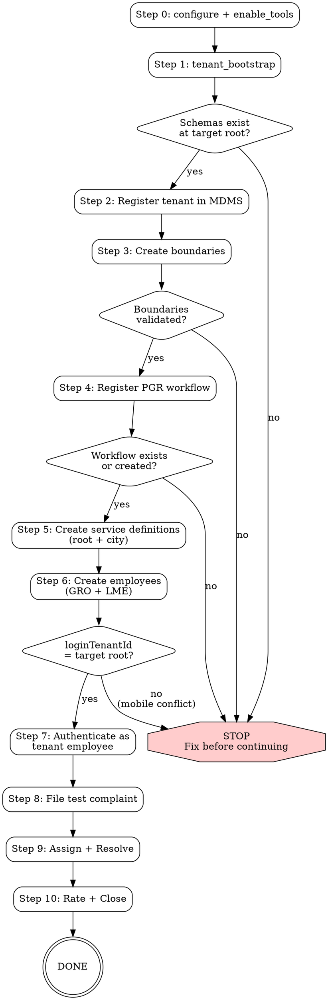

# DIGIT Tenant Setup

Hard-gated 10-step procedure for setting up a new city on the DIGIT PGR platform. Every step has a verification gate. Do NOT proceed past a gate that fails.

## IRON LAW

```
NO PGR OPERATIONS WITHOUT TENANT EMPLOYEE AUTHENTICATION FIRST.
```

If you are logged in as ADMIN (loginTenantId = "pg"), PGR calls on any non-pg tenant WILL fail with "User is not authorized". You MUST authenticate as a tenant employee (Step 6) before Steps 7-10.

---

## Setup Procedure Flowchart



---

## Guided Setup Flow (Non-Technical Users)

One question at a time. Hide ALL technical complexity. WAIT for the user to answer before proceeding.

**Phase 1 — Identity** (derive tenant codes automatically)
- "What's the name of your city or municipality?"
- "What state is it in?"

**Phase 2 — Services**
- "What kinds of complaints do citizens usually raise? For example: broken streetlights, garbage not collected, potholes, water supply issues..."
- Map answers to PGR service codes silently. Never mention codes or MDMS.

**Phase 3 — Staff**
- "Who should receive and assign complaints? Give me their name and phone number."
- "Who should be the field worker who resolves them? Name and phone number?"

**Phase 4 — Done**
- Run the full setup silently. Report as milestones: "Registered [City]", "Set up complaint types", "Created staff accounts"
- End with: "Your system is ready. Citizens can now file complaints under [City Name]."

**CRITICAL**: Never mention tenants, MDMS, boundary hierarchies, service definitions, localization keys, employee codes, or any technical term. If setup fails, say "Let me try a different approach" and handle silently.

---

## Step-by-Step Procedure

### Step 0 — Connect
```
configure(environment="chakshu-digit")
enable_tools(enable=["mdms","boundary","masters","employees","pgr","admin","idgen"])
```

### Step 1 — Bootstrap tenant root
```
tenant_bootstrap(target_tenant="<root>", source_tenant="pg")
```
**GATE**: Call `mdms_schema_search(tenant_id="<root>")`. Must return schemas. If 0 schemas → STOP, bootstrap failed.

### Step 2 — Register tenant in MDMS
```
mdms_create(
  tenant_id = "<root>",
  schema_code = "tenant.tenants",
  unique_identifier = "<root>.<city>",
  data = {
    code: "<root>.<city>", name: "<City Name>",
    description: "...", type: "CITY",
    city: { name, localName, districtCode, districtName,
            regionName, ulbGrade, latitude, longitude, code }
  }
)
```
**GATE**: Call `validate_tenant(tenant_id="<root>.<city>")`. Must return the tenant.

### Step 3 — Create boundaries
Use real locality names from boundary data sources (see below).
```
boundary_create(
  tenant_id = "<root>.<city>",
  hierarchy_definition = ["State", "District", "City", "Locality"],
  boundaries = [
    { code: "<ST>", type: "State" },
    { code: "<ST>_<DIST>", type: "District", parent: "<ST>" },
    { code: "<DIST>_CITY", type: "City", parent: "<ST>_<DIST>" },
    { code: "<PREFIX>_<LOC>", type: "Locality", parent: "<DIST>_CITY" },
    ...
  ]
)
```
**GATE**: Call `validate_boundary(tenant_id="<root>.<city>")`. Must show localities under the city.

### Step 4 — Register PGR workflow
Only needed once per state root. City tenants inherit.
```
workflow_create(tenant_id="<root>.<city>", copy_from_tenant="pg.citya")
```
If response says `skipped: ["PGR"]` — workflow already exists, proceed.
**GATE**: Call `workflow_business_services(tenant_id="<root>", business_services=["PGR"])`. Must return the PGR state machine.

### Step 5 — Create service definitions
Must register at BOTH state root AND city level.
```
# 5a — State root (required for pgr_create to resolve service codes)
mdms_create(
  tenant_id = "<root>",
  schema_code = "RAINMAKER-PGR.ServiceDefs",
  unique_identifier = "<ServiceCode>",
  data = { serviceCode, name, keywords: "comma,separated", menuPath: "<Category>",
           department, slaHours, active: true }
)

# 5b — City level (required for city-scoped filtering)
mdms_create(
  tenant_id = "<root>.<city>",
  schema_code = "RAINMAKER-PGR.ServiceDefs",
  unique_identifier = "<ServiceCode>",
  data = { serviceCode, name, keywords: "...", department, slaHours, active: true }
)
```
Field rules:
- `keywords` must be a plain string (e.g. `"road,pothole,damaged"`), not a JSON array
- Do NOT include `menuPathName` or `description` — schema rejects them
- Use `menuPath` (no "Name") at root level only

**GATE**: Call `validate_complaint_types(tenant_id="<root>.<city>")`. Must list all created service codes.

### Step 6 — Create employees
```
employee_create(
  tenant_id = "<root>.<city>",
  name, mobile_number,
  roles = [{ code: "EMPLOYEE", name: "Employee" }, { code: "GRO", name: "Grievance Routing Officer" }],
  department, designation,
  jurisdiction_boundary_type = "City",
  jurisdiction_boundary = "<DIST>_CITY"
)
```
- GRO: roles = `[EMPLOYEE, GRO]`
- LME: roles = `[EMPLOYEE, PGR_LME]`
- Do NOT include CITIZEN or CSR — HRMS rejects them
- Save the returned employee code (e.g. `EMP-CBE-000058`) for login

**GATE**: Call `validate_employees(tenant_id="<root>.<city>", required_roles=["GRO","PGR_LME"])`. Must find both roles.

### Step 7 — Authenticate as tenant employee
```
configure(
  username = "<EMPLOYEE_CODE>",
  password = "eGov@123",
  tenant_id = "<root>.<city>"
)
```
**GATE**: Response must show `loginTenantId = "<root>"` (NOT `"pg"`). If it shows `"pg"`, the employee's user was linked to an existing pg user (mobile number conflict). Try a different employee or use a unique mobile number.

### Step 8 — File a test complaint
```
pgr_create(
  tenant_id = "<root>.<city>",
  service_code = "<ServiceCode>",
  description = "Test complaint for verification",
  address = { locality: { code: "<LOCALITY_CODE>" }, city: "<City>" },
  citizen_name = "Test Citizen",
  citizen_mobile = "<unique 10-digit>"
)
```
**GATE**: Call `pgr_search(tenant_id="<root>.<city>")`. Must return the complaint with status `PENDINGFORASSIGNMENT`.

### Step 9 — Assign and resolve
```
pgr_update(action="ASSIGN", service_request_id="...", tenant_id="<root>.<city>")
```
Do NOT pass `assignees` — explicit UUID assignment fails. Let PGR auto-route.

Then authenticate as LME and resolve:
```
configure(username="<LME_CODE>", password="eGov@123", tenant_id="<root>.<city>")
pgr_update(action="RESOLVE", service_request_id="...", tenant_id="<root>.<city>")
```
**GATE**: `pgr_search` must show status `RESOLVED`.

### Step 10 — Citizen rates
```
configure(username="<citizen_mobile>", password="eGov@123", tenant_id="<root>.<city>")
pgr_update(action="RATE", service_request_id="...", tenant_id="<root>.<city>", rating=5)
```
**GATE**: `pgr_search` must show status `CLOSEDAFTERRESOLUTION`. Setup complete.

---

## Boundary Data Sources

### 1. OpenStreetMap Overpass API (Recommended)
- URL: `https://overpass-api.de/api/interpreter`
- Best for: locality/suburb/neighbourhood level
- Query for all localities within a city:
```bash
curl -sL "https://overpass-api.de/api/interpreter" \
  --data-urlencode 'data=[out:json][timeout:30];
    area["name"="<CityName>"]["boundary"="administrative"]->.city;
    (node["place"~"suburb|neighbourhood|quarter"](area.city););
    out tags;' \
  | python3 -c "
import json, sys
data = json.load(sys.stdin)
names = sorted(set(el['tags']['name'] for el in data['elements'] if 'name' in el.get('tags',{})))
for n in names: print(n)
print('Total:', len(names))
"
```
- Returns 100-300+ real locality names per city
- Verified: Chennai (264), Trichy, Coimbatore

### 2. sab99r/Indian-States-And-Districts
- URL: `https://raw.githubusercontent.com/sab99r/Indian-States-And-Districts/master/states-and-districts.json`
- Best for: State → District hierarchy across all Indian states

### 3. Quick Decision Guide
| Need | Source |
|------|--------|
| Districts for a state | sab99r GitHub |
| Localities/suburbs in a city | Overpass API |
| Ward boundaries with geometry | datameet (check availability) |
| Official government data | data.gov.in or Bhuvan |

---

## Rationalization Table

These are things you might be tempted to skip. DO NOT.

| Rationalization | Why it's wrong | What to do instead |
|----------------|---------------|-------------------|
| "I'll skip bootstrap, schemas probably exist" | Without bootstrap, mdms_create fails with "Schema definition not found" | Always run tenant_bootstrap for new roots |
| "I'll use ADMIN user for PGR operations" | ADMIN's roles are scoped to pg. PGR on other tenants returns 403 | Authenticate as tenant employee (Step 7) |
| "I'll create service defs only at root" | City-level filtering won't work, and some queries need city-level records | Create at BOTH root and city level |
| "I'll pass assignees to pgr_update" | Explicit UUID assignment fails with tracer exception | Omit assignees, let PGR auto-route |
| "I'll include CITIZEN role in employee" | HRMS rejects CITIZEN and CSR roles for employees | Only EMPLOYEE + specific PGR roles |
| "Mobile number conflicts don't matter" | loginTenantId gets set to wrong root, all PGR ops fail | Use unique mobile numbers per tenant |
| "I'll skip the verification gate" | Silent failures propagate — a missing workflow causes pgr_create to 500 | Run every gate check |

---

## Red Flags

If you see any of these, STOP and investigate:
- `loginTenantId` doesn't match the target tenant root
- `pgr_create` returns "Failed to parse mdms response for service"
- `employee_create` returns 400 with "userName=null"
- `workflow_create` returns error (not "skipped")
- `validate_boundary` shows 0 localities

---

## Error Reference

See [error-reference.md](error-reference.md) for the full error → fix table.

---

## Environment
- **Key**: `chakshu-digit` | **URL**: `https://api.egov.theflywheel.in`
- **State tenant**: `tenant` | **Login tenant**: `pg` (ADMIN only)
- Always call `configure` first, then `enable_tools` for required groups.
