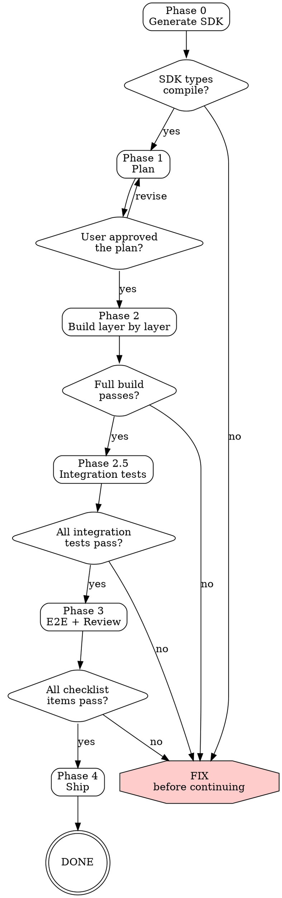

# DIGIT UI Building

Hard-gated process for building PGR complaint management UIs. Every phase has a gate. Do NOT skip phases.

## IRON LAW

```
NO HAND-WRITTEN FETCH CALLS TO DIGIT APIS.
```

All API calls MUST go through the generated SDK. Hand-written fetch calls lead to silent contract bugs that only surface at runtime.

---

## Phase Progression Flowchart



---

## Phase 0 — Generate DIGIT SDK

Before writing ANY application code:

1. **Export OpenAPI spec**: Call `api_catalog(format="openapi")` via MCP, save as `digit-api.json` in project root
2. **Generate TypeScript types**: `npx openapi-typescript digit-api.json -o src/lib/digit-api.d.ts`
3. **Create typed client**: Use `openapi-fetch` with DIGIT RequestInfo adapter (see `local://ui.md` Section 3.5)
4. **Install dependencies**: `openapi-fetch` (runtime), `openapi-typescript` (dev)

**GATE**: Run `npx tsc --noEmit`. SDK types must compile with zero errors.

### SDK Bug Examples

Real bugs caught by the SDK approach:

| Bug | Root cause | Caught by |
|-----|-----------|-----------|
| HRMS employee search returns 400 | Missing required `offset` query param | **SDK** — spec has `offset` with `default: 0`; typed client requires it |
| PGR assign returns 400 | Sent `assignes: ["uuid"]`, API needs `[{uuid: "uuid"}]` | **Integration test** — real API call 400'd |

### Three-Layer Safety Net

```
Layer 1: SDK (generated from OpenAPI spec → compile-time safety)
Layer 2: Integration tests (real API calls → catches spec inaccuracies)
Layer 3: Spec feedback loop (test failures → fix spec → re-generate SDK)
```

---

## Phase 1 — Plan Before Coding

1. **Read the UI guide**: Call `docs_get` with `local://ui.md` — read architecture patterns, component library, API integration, and UI Review Checklist (Section 14)
2. **Understand the target**: What screens? What roles? Map to PGR lifecycle (File → Assign → Resolve → Rate/Close)
3. **Plan file structure** — list every file, grouped by layer:
   - Layer 1: Config, types, constants, CSS
   - Layer 2: API client (SDK-based), auth context
   - Layer 3: Hooks (data fetching)
   - Layer 4: UI components (atoms/molecules)
   - Layer 5: Page components (organisms)
4. **Present plan to user**: file tree, routes, which APIs each page calls, auth approach

**GATE**: User must approve the plan before coding starts.

---

## Phase 2 — Build Layer by Layer

Write code in layer order (1 → 5). Build and fix TypeScript errors after each layer.

- Layer 2 (API client) MUST use the generated SDK — never hand-write fetch calls
- After all layers done: `npm run build` — must pass with zero errors

**GATE**: Full build passes. No TypeScript errors.

---

## Phase 2.5 — Integration Tests

Before E2E testing, verify every API call uses correct parameters against a real DIGIT cluster.

Write integration tests covering:
- Auth: login as EMPLOYEE, login as CITIZEN
- HRMS: search employees (with required `offset`/`limit`)
- MDMS: fetch service definitions, departments
- Boundary: fetch localities
- PGR lifecycle: create → assign → resolve → rate
- Workflow: fetch audit trail
- Localization: fetch UI labels

Run via the same Next.js rewrite proxy (`/digit-api/*`) the UI uses, or direct API calls.

**GATE**: All integration tests pass. If a test fails, determine if it's a code bug or spec bug — fix both.

See `local://ui.md` Section 13.5 for the full integration testing guide.

---

## Phase 3 — E2E + Review

1. **Run E2E tests** (write if they don't exist):
   - Login page rendering + quick-login presets
   - Each role's primary flow (citizen files, GRO assigns, LME resolves)
   - Mobile viewport rendering
   - Logout flow

2. **Capture screenshots** of every screen at every state

3. **Review against UI Review Checklist** — see [ui-review-checklist.md](ui-review-checklist.md). Check EVERY item.

4. **Fix every issue found** before proceeding

**GATE**: All checklist items pass. All E2E tests pass.

---

## Phase 4 — Ship

Final verification:
- [ ] E2E tests pass
- [ ] Integration tests pass
- [ ] Every screen reviewed against checklist
- [ ] Mobile viewport tested at 375px
- [ ] All quick-login presets work
- [ ] Complaint lifecycle tested end-to-end
- [ ] No raw codes/IDs shown to users
- [ ] Loading and error states on every data-fetching page
- [ ] Screenshots captured and saved
- [ ] SDK types generated from latest OpenAPI spec
- [ ] All API calls go through typed SDK client
- [ ] Any spec discrepancies documented for MCP server fix

---

## Rationalization Table

These are things you might be tempted to do. DO NOT.

| Rationalization | Why it's wrong | What to do instead |
|----------------|---------------|-------------------|
| "I'll just write fetch calls, it's faster" | Hand-written calls guess wrong param names, miss required fields, use wrong body shapes | Generate SDK from OpenAPI spec (Phase 0) |
| "Integration tests are overkill for a UI" | Spec inaccuracies only surface at runtime; SDK alone doesn't catch them | Write integration tests against real cluster (Phase 2.5) |
| "The build passes so API calls must be correct" | TypeScript checks types, not runtime behavior. Wrong param names still compile if typed as `any` | Integration tests verify actual API responses |
| "I'll skip the review checklist" | Raw locality codes, broken mobile layouts, missing states slip through | Review every screen against checklist (Phase 3) |
| "I'll add the SDK later" | Once fetch calls exist, they never get replaced. Technical debt compounds | SDK is Phase 0 — before any other code |
| "I'll test on desktop only" | DIGIT users are primarily on mobile (government field workers) | Test at 375px viewport in Phase 3 |

---

## DIGIT Component Library

When the user wants DIGIT's visual style, use the published npm packages:

| Package | Purpose |
|---------|---------|
| `@egovernments/digit-ui-react-components` | React components |
| `@egovernments/digit-ui-css` | CSS styles (works without React) |
| `@egovernments/digit-ui-svg-components` | 827+ icons |
| `@egovernments/digit-ui-libraries` | Hooks & utilities |

**CSS-only (no React dependency)**:
```html
<link rel="stylesheet" href="https://unpkg.com/@egovernments/digit-ui-css/dist/index.css" />
```

**Key pattern → component mapping**:

| Pattern | DIGIT Component |
|---------|----------------|
| Fixed bottom bar | `ActionBar` + `SubmitBar` |
| Key-value detail rows | `StatusTable` + `Row` |
| Vertical timeline | `ConnectingCheckPoints` + `CheckPoint` |
| Toast notifications | `Toast` |
| "Take Action" popup | `Menu` |
| Modal dialog | `Modal` |
| Multi-select with chips | `MultiSelectDropdown` + `RemoveableTag` |
| Multi-step wizard | `FormComposer` or `FormStep` |
| Inbox with filters/search | `InboxComposer` |
| Mobile overlay | `PopUp` |

**Where to look up components**:
- MCP docs: `docs_get("local://ui.md")` → "DIGIT UI Component Library" section
- Storybook: https://unified-dev.digit.org/storybook
- SVG icons: https://unified-dev.digit.org/storybook-svg/
- Component docs: https://docs.digit.org/platform/guides/developer-guide/ui-developer-guide/digit-ui-components0.2.0/atom

For full import paths and pattern mapping, read `local://ui.md`.
