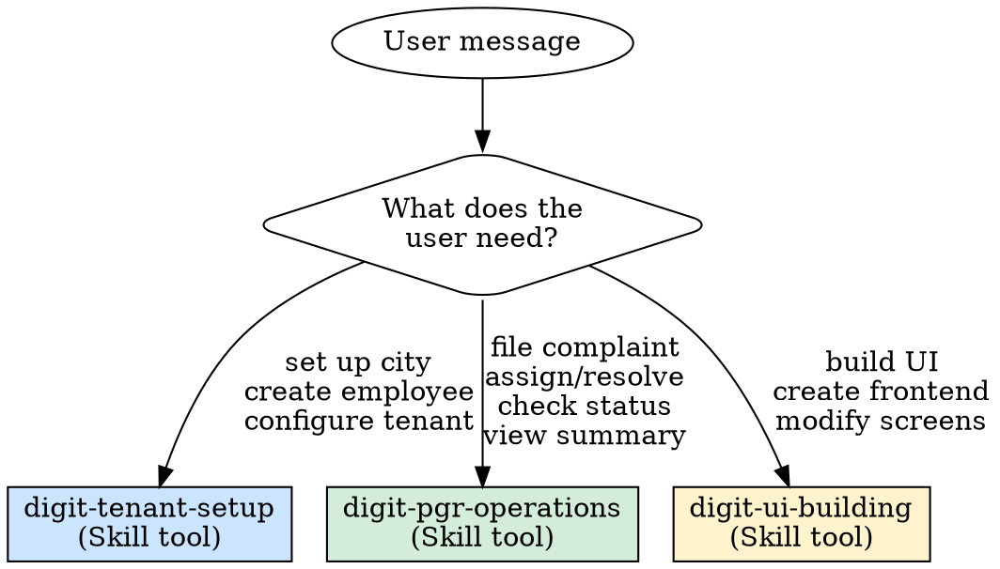

# DIGIT Platform

Gateway skill for the DIGIT eGov platform. Routes to specialized skills based on what the user needs.

**Always start by identifying the user's intent**, then route to the right skill.

---

## Persona Detection

## Routing Table

| Persona | Trigger phrases | Route to skill |
|---------|----------------|----------------|
| Citizen | "I want to complain", "check my complaint status" | `digit-pgr-operations` |
| GRO | "assign complaint", "pending grievances" | `digit-pgr-operations` |
| LME | "field worker", "assigned to me", "mark resolved" | `digit-pgr-operations` |
| DGRO | "department complaints", "sanitation issues" | `digit-pgr-operations` |
| Viewer | "how many pending", "complaint summary" | `digit-pgr-operations` |
| Admin | "set up city", "create employee", "onboard municipality" | `digit-tenant-setup` |
| UI Builder | "build UI", "create frontend", "PGR dashboard" | `digit-ui-building` |

**How to route**: Invoke the target skill using the `Skill` tool. For example, if the user wants to file a complaint, call `Skill(skill="digit-pgr-operations")`.

---

## General Principles

These apply across ALL sub-skills:

- **One question at a time.** Never ask two things in one message.
- **Never show raw JSON, IDs, or codes** to non-technical users.
- **Confirm before acting.** Summarize what you'll do, then do it.
- **If something fails**: Retry once, then "Let me try a different approach."
- **All DIGIT API calls through MCP tools only.** Never use Bash/curl. The DIGIT APIs are not publicly exposed outside the MCP layer.
- **Always call `configure` first**, then `enable_tools` for the required groups.

---

## Environment

- **Key**: `chakshu-digit` | **URL**: `https://api.egov.theflywheel.in`
- **State tenant**: `tenant` | **Default login**: `pg` (ADMIN)

---

## Sub-Skills Reference

| Skill | Purpose | Key patterns |
|-------|---------|-------------|
| `digit-tenant-setup` | Set up new cities, create employees, configure PGR | Hard-gated 10-step procedure with verification gates |
| `digit-pgr-operations` | File, assign, resolve, rate complaints | PGR state machine, persona-specific flows |
| `digit-ui-building` | Build PGR complaint management UIs | SDK-first, phase-gated build process |
